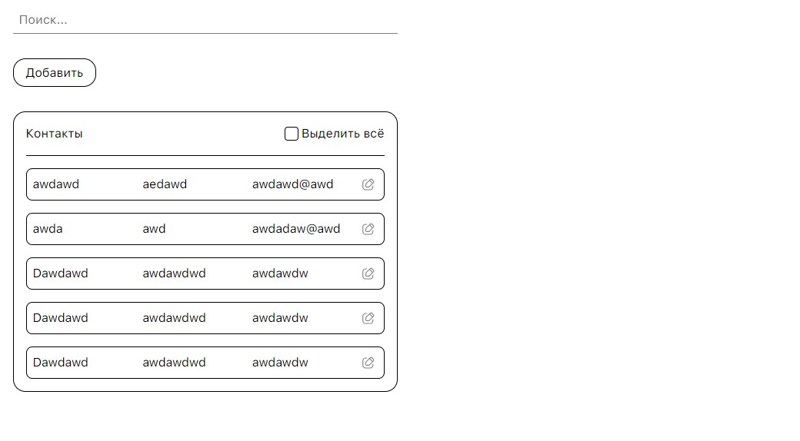

# test-task-to

## Описание
Создайте небольшое веб-приложение "Управление контактами" (Contact Management) с
использованием Vue 3. Приложение должно позволять пользователю:
- Добавлять новые контакты с полями: имя, телефон, email.
- Редактировать существующие контакты.
- Удалять контакты.
- Искать контакты по имени.

## Требования
- Инициализация проекта: Создайте проект с использованием Vue CLI + TypeScript.
- Компоненты: Разбейте приложение на несколько компонентов, например:
  - App.vue: Основной компонент приложения.
  - ContactList.vue: Компонент для отображения списка контактов.
  - ContactItem.vue: Компонент для отображения одного контакта.
  - ContactForm.vue: Компонент для добавления и редактирования контактов.
  - SearchBar.vue: Компонент для поиска контактов.
- Реактивность: Используйте реактивные свойства для управления состоянием
   контактов.
- Директивы: Примените директивы Vue для реализации основной функциональности.
- Стилизация: Минимально стилизуйте приложение с помощью CSS или любого
   CSS-фреймворка на ваш выбор (например, Bootstrap, Tailwind).
- Получение данных. Реализуйте фейковые данные и их получение с помощью методов
   для работы с API.
- Хранение данных: Реализуйте хранение данных о контактах в localStorage, чтобы при
   перезагрузке страницы контакты сохранялись.
- Валидация формы: Добавьте валидацию формы для добавления и редактирования
   контактов (например, обязательность полей, проверка формата email).

## Дополнительные (необязательные) задания
- Анимации: Добавьте анимации при добавлении, редактировании и удалении контактов
   с помощью Vue Transition.
- Тестирование: Напишите простые юнит-тесты для одного из компонентов с
   использованием Jest или другого тестового фреймворка.


Рабочая версия приложение находится по ссылке: [Test task](https://test-task-to.vercel.app/)



## Локальный запуск проекта

### Скачать zip-архив с репозитория [GitHub](https://github.com/DmitryMarc/test-task-TO) и распаковать, либо через консоль выполнить следующую команду:
```
git clone https://github.com/DmitryMarc/test-task-TO.git
```

### Находясь внутри папки с проектом, установить зависимости:
```
pnpm install
```

### Запуск проекта в режиме разработки:
```
pnpm run serve
```
Далее перейти по ссылке [http://localhost:8080/](http://localhost:8080/)

### Сборка проекта:
```
pnpm run build
```
Проект будет собран в папке ./dist

### Линтинг проекта:
```
pnpm run lint
```
